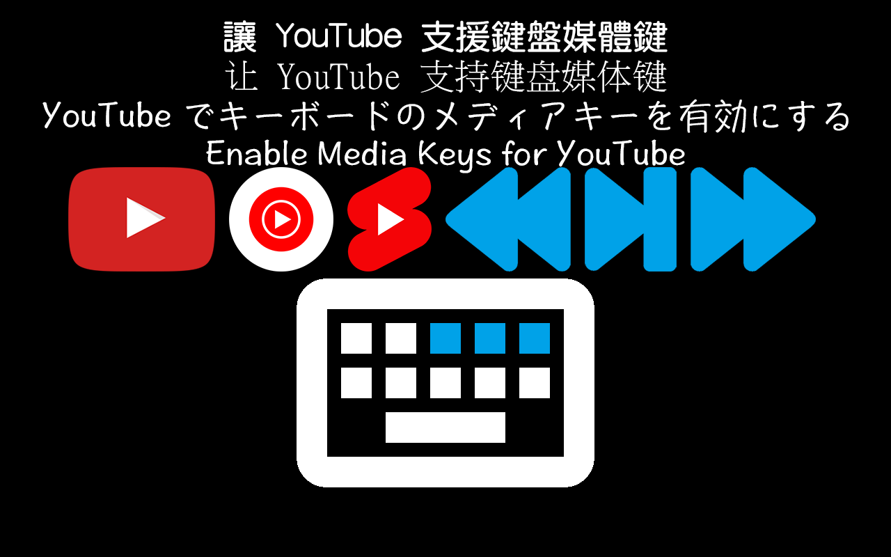

# [B.M] YouTube 支援鍵盤媒體鍵

[](https://developer.chrome.com/docs/extensions/mv3/)
[](https://www.youtube.com)
[](https://music.youtube.com)
[](https://github.com/BoringMan314/bm-youtube-keyboard-media-keys)
[](LICENSE)

適用於 [**YouTube**](https://www.youtube.com)（`youtube.com`）與 [**YouTube Music**](https://music.youtube.com)（`music.youtube.com`）的瀏覽器擴充功能：將鍵盤 **播放／暫停、上一首、下一首** 媒體鍵對應到 **Shorts**、一般長影片（`/watch`、`/live`）與 **YouTube Music**；可於工具列彈出面板 **開關** 是否攔截媒體鍵。

*将键盘 **播放/暂停、上一首、下一首** 映射到 YouTube Shorts、长视频与 YouTube Music，可在工具栏开关。*<br>
*キーボードの **再生・一時停止／前の曲／次の曲** を YouTube Shorts・長尺動画・YouTube Music に割り当て、ツールバーでオン／オフできます。*<br>
*Maps **Play-Pause, Previous, Next** hardware keys to YouTube Shorts, long-form video, and YouTube Music, with a toolbar toggle.*

> **聲明**：本專案為第三方輔助工具，與 Google／YouTube／YouTube Music 官方無關。使用請遵守各服務條款與著作權規範。

---



---

## 目錄

- [功能](#功能)
- [系統需求](#系統需求)
- [安裝方式](#安裝方式)
- [本機開發與測試](#本機開發與測試)
- [技術概要](#技術概要)
- [專案結構](#專案結構)
- [版本與多語系](#版本與多語系)
- [隱私說明](#隱私說明)
- [維護者：更新 GitHub 與 Chrome 線上應用程式商店](#維護者更新-github-與-chrome-線上應用程式商店)
- [授權](#授權)
- [問題與建議](#問題與建議)

---

## 功能

- **播放／暫停**：由擴充功能注入頁面操作播放器（Chrome 攔截媒體鍵時的常見需求）。
- **Shorts**：媒體「上一首／下一首」切換短影片；留言面板開啟時會先嘗試關閉再導覽。
- **長影片**：上一首為瀏覽器 **上一頁**（`history.back()`）；下一首模擬 **Shift+N**。
- **YouTube Music**：操作播放列；歌單頁尚未播放時優先從標題區或第一首開始；非 YouTube 前景分頁時可優先控制最近使用的 Music 分頁。
- **全域快捷鍵**：[`manifest.json`](manifest.json) 內三個 `commands` 皆已設 `"global": true`（Chrome 只能逐條指令宣告，沒有「一次全部」的單一欄位）。安裝後請到 `chrome://extensions/shortcuts` **確認**皆為 **全域**；若仍顯示「僅限 Chrome」再手動改，並綁定媒體鍵。
- **開關**：關閉時不處理媒體鍵，工具列圖示顯示 **×**。

---

## 系統需求

- **Chrome** 或 **Microsoft Edge**（Chromium）等支援 **Manifest V3** 的瀏覽器。

---

## 安裝方式

### 從 Chrome 線上應用程式商店（建議）

請在 [Chrome Web Store](https://chromewebstore.google.com/) 搜尋 **「[B.M] YouTube 支援鍵盤媒體鍵」**（[商店頁面](https://chromewebstore.google.com/detail/bm-youtube-%E6%94%AF%E6%8F%B4%E9%8D%B5%E7%9B%A4%E5%AA%92%E9%AB%94%E9%8D%B5/omadcnhemhgioppikilldhakofffpejm?hl=zh-TW)），或從上列直接連結安裝。

### 從原始碼載入（開發人員模式）

1. 點選本頁綠色 **Code** → **Download ZIP** 解壓，或執行 `git clone https://github.com/BoringMan314/bm-youtube-keyboard-media-keys.git` 複製本倉庫。
2. 以 **Chrome** 或 **Microsoft Edge** 開啟 `chrome://extensions`（在 Edge 為 `edge://extensions`）。
3. 開啟「**開發人員模式**」→「**載入未封裝項目**」→ 選取含 [`manifest.json`](manifest.json) 的**專案根目錄**（勿選子資料夾）。
4. 開啟 `chrome://extensions/shortcuts`，**確認**本擴充三個指令為 **全域**（`manifest` 已預設 `global: true`，多數情況無須改）；必要時改為全域並綁定媒體鍵。

---

## 本機開發與測試

修改 [`background.js`](background.js)、[`popup.js`](popup.js)、[`options.js`](options.js) 或 [`_locales/`](_locales/) 後，在 `chrome://extensions` 將本擴充**重新載入**，再重新整理 YouTube／YouTube Music 分頁驗證。

---

## 技術概要

- **Service worker** [`background.js`](background.js) 監聽 `chrome.commands`，以 `chrome.scripting.executeScript` 在頁面 **MAIN** 世界注入邏輯（點擊導覽、模擬快捷鍵、`history.back()`、`video.play()` 等）。
- **快捷鍵列表順序**：`chrome://extensions/shortcuts` 會依 **指令 ID 字典序** 排列，與 `manifest.json` 內撰寫順序無關；本專案因此使用 `media-1-playpause`、`media-2-prev`、`media-3-next`，畫面上才會是 **播放／暫停 → 上一首 → 下一首**。
- **「尚未設定」**：`manifest` 裡若為某指令寫了 **suggested_key**（例如 `MediaPlayPause`），Chrome 會視為已建議綁定，該列會顯示**按鍵名稱**（如「媒體播放/暫停」），而不是「尚未設定」。**啟用擴充功能**（開啟工具列動作）通常沒有預設鍵，故常顯示「尚未設定」。
- **權限**：`scripting`、`tabs`、`storage`；`host_permissions` 限 `youtube.com` 與 `music.youtube.com`。
- **無**內容腳本常駐注入；僅在快捷鍵觸發時對目標分頁執行腳本。

---

## 專案結構

| 路徑 | 說明 |
|------|------|
| [`manifest.json`](manifest.json) | Manifest V3、`commands`、多語系 `default_locale` |
| [`background.js`](background.js) | 指令處理、分頁挑選、注入腳本、badge／`storage` 開關 |
| [`popup.html`](popup.html)／[`popup.js`](popup.js) | 工具列彈出面板：開關與開啟說明頁 |
| [`options.html`](options.html)／[`options.js`](options.js) | 完整說明（多語系字串套用） |
| [`_locales/`](_locales/) | 多語系字串（`zh_TW`、`zh_CN`、`ja_JP`、`en_US`） |
| [`privacy-policy.html`](privacy-policy.html) | 隱私權政策（上架商店所需之公開網頁） |
| [`icons/`](icons/) | 工具列與商店用圖示：icon.png |
| [`screenshot/`](screenshot/) | 商店與說明用截圖 |

---

## 版本與多語系

- **版本**：以 [`manifest.json`](manifest.json) 的 `version` 為準。
- **預設語系**：`zh_TW`（`default_locale`）。
- **內建語系**：`zh_TW`、`zh_CN`、`ja_JP`、`en_US`（路徑為 `_locales/<code>/messages.json`）。實際顯示依瀏覽器語系與遞減規則。

---

## 隱私說明

本擴充**不蒐集、不上傳**可識別個人之帳戶或瀏覽內容；**未內建**遠端可執行程式、分析或廣告追蹤。僅於本機以 `chrome.storage` 儲存開關等設定。詳見 [`privacy-policy.html`](privacy-policy.html)。

**上架提醒**：若上架 Chrome Web Store，須在開發人員後台完成隱私實踐聲明，並提供本政策之**公開 HTTPS 網址**（建議以 [GitHub Pages](https://pages.github.com/) 託管專案內的 `privacy-policy.html`）。

---

## 維護者：更新 GitHub 與 Chrome 線上應用程式商店

### 更新至 GitHub

**Bash / Git Bash / PowerShell：**

```powershell
git add .
git commit -m "docs: 更新內容說明與商店連結"
git push origin main
```

### 更新至 Chrome 線上應用程式商店

請透過 [Chrome Web Store 開發人員控制台](https://chrome.google.com/webstore/devconsole) 手動上傳更新：

1. **遞增版本**：修改 `manifest.json` 中的 `version`（例如從 `0.1.0` 提升至 `0.1.1`）。
2. **封裝套件**：將專案內容壓縮為 ZIP 檔。
   - **必要檔案**：`manifest.json`, `background.js`, `popup.html`, `popup.js`, `options.html`, `options.js`, `privacy-policy.html`, `icons/`, `_locales/`
   - **建議不打包**：`.git/`, `.gitignore`, `README.md`, `screenshot/`, `*.psd`, `*.zip`, `*.url`
3. **上傳審核**：在控制台選擇項目 →「套件」→「上傳新套件」。
4. **提交送審**：確認版號、商店文案、截圖、隱私欄位與 `privacy-policy` 公開網址無誤後，點擊「**提交送審**」。

---

## 授權

本專案以 [MIT License](LICENSE) 授權。

---

## 問題與建議

歡迎透過 [GitHub Issues](https://github.com/BoringMan314/bm-youtube-keyboard-media-keys/issues) 回報錯誤或提出改善建議。回報時請一併提供瀏覽器版本、**介面語言**及重現步驟。
